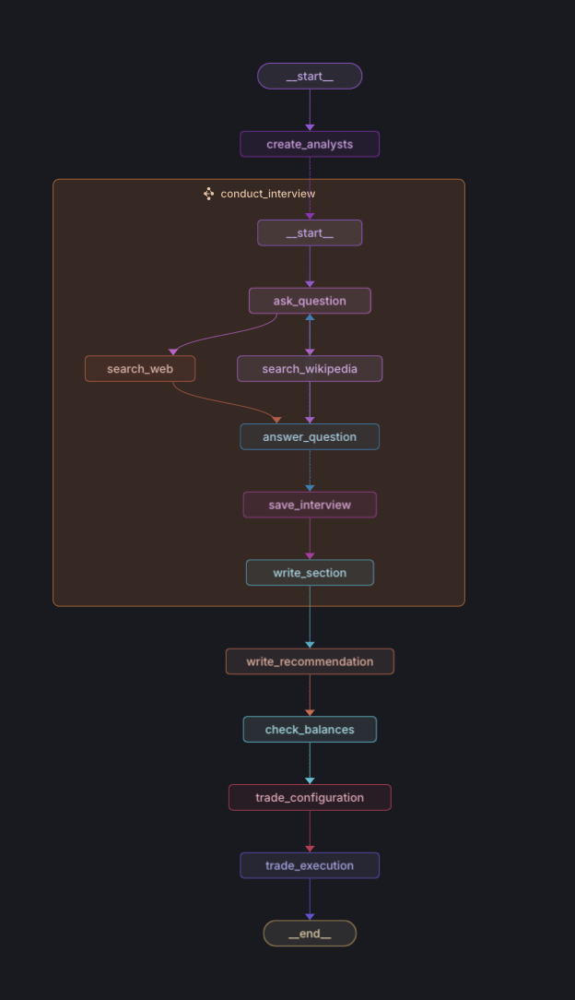

# Polymarket Trading Agent

## Overview

An AI-agent for interacting with Polymarket's prediction markets.
The agent reviews open prediction markets, goes through various research processes, and makes trades based on the results.

The quality of the trading decisions are a direct function of the quality of the research done in the conduct_interview subgraph, and the agents self-awareness to know which markets it could have an edge in.

This project as it is is a PoC and not extremely intelligent, but the framework is there to add more and more intelligence as needed from different sources (i.e Reddit, Youtube, Google Trends, and anything else thats relevant to a given prediction market).


## LangGraph

One intention of this project was to get experience with LangGraph, LangChain, and the various tools that LangGraph has to offer.

Below is the graph visualization of the agent's workflow:



The graph is generated using [LangGraph Studio](https://github.com/langchain-ai/langgraph-studio).
The boxed subgraph takes an "interviewer" role, in order to best tease information out of the LLM agents.

## Installation

1. Clone the repo.

2. Create and activate a virtual environment (I'm using python 3.13):
```bash
uv venv --python 3.13
source .venv/bin/activate  # On Windows, use `.venv\Scripts\activate`
```

3. Install dependencies:
```bash
uv sync
```

4. Create a `.env` file with your configuration:
```env
MAX_BET_SIZE=10
RISK_TOLERANCE=0.5

SERPAPI_KEY=
TAVILY_API_KEY=

OPENAI_API_KEY=
LANGCHAIN_API_KEY=
LANGCHAIN_TRACING_V2=true
POLYMARKET_PROXY_ADDRESS=
POLYMARKET_PRIVATE_KEY=
```

## Project Structure

```
├── data_fetchers.py     # Market data fetching utilities
├── models.py            # Data models and types
├── trade_tools.py       # Trading functionality
├── requirements-dev.txt # Development dependencies
└── .bandit             # Security configuration
```

## Security

This project uses Bandit for security scanning. To run security checks:

```bash
bandit -r . -c .bandit
```

## Development

### Setting up for development

1. Install development dependencies:
```bash
pip install -r requirements-dev.txt
```

2. Run security checks before committing:
```bash
bandit -r .
```

## Roadmap

### Upcoming Features

- Add more tools to the agent's available tools:
  - Reddit sentiment analysis
  - Google Trends data integration
  - Twitter/X social media analysis
- Add a 'manager' to manage open positions:
  - Automated position trimming for risk management
  - Take-profit execution for winning trades
  - Dynamic position sizing based on performance

## License

MIT License

Copyright (c) 2024 polymarketagent

Permission is hereby granted, free of charge, to any person obtaining a copy
of this software and associated documentation files (the "Software"), to deal
in the Software without restriction, including without limitation the rights
to use, copy, modify, merge, publish, distribute, sublicense, and/or sell
copies of the Software, and to permit persons to whom the Software is
furnished to do so, subject to the following conditions:

The above copyright notice and this permission notice shall be included in all
copies or substantial portions of the Software.

THE SOFTWARE IS PROVIDED "AS IS", WITHOUT WARRANTY OF ANY KIND, EXPRESS OR
IMPLIED, INCLUDING BUT NOT LIMITED TO THE WARRANTIES OF MERCHANTABILITY,
FITNESS FOR A PARTICULAR PURPOSE AND NONINFRINGEMENT. IN NO EVENT SHALL THE
AUTHORS OR COPYRIGHT HOLDERS BE LIABLE FOR ANY CLAIM, DAMAGES OR OTHER
LIABILITY, WHETHER IN AN ACTION OF CONTRACT, TORT OR OTHERWISE, ARISING FROM,
OUT OF OR IN CONNECTION WITH THE SOFTWARE OR THE USE OR OTHER DEALINGS IN THE
SOFTWARE.

## Disclaimer

This software is for educational purposes only. Trading carries risk. Use at your own discretion.

